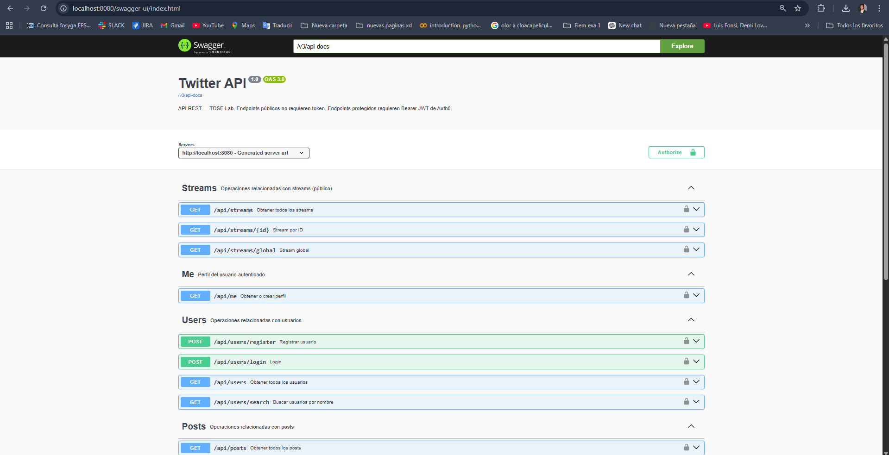

# Secure Twitter-like App: Monolith to Serverless Microservices (Auth0 + AWS)

## 1) Project Summary

This repository contains an experimental assignment implementation of a simplified Twitter-like platform.

## 0) Diagram Placement Guide (Mermaid)

If you need to re-paste the diagrams manually, use this exact mapping:

1. Paste **Evolution diagram (Monolith -> Microservices)** under section **3) Repository Structure and Architecture Evolution**.
2. Paste **Monolith module architecture** under section **4) Monolith Deep Analysis**.
3. Paste **Auth flow in monolith** under section **4) Monolith Deep Analysis**, right below "Monolith security strategy".
4. Paste **Microservices topology diagram** under section **6) Microservices Deep Analysis**.
5. Paste **Create-post flow in microservices** under section **6) Microservices Deep Analysis**.
6. Paste **Stream-read flow in microservices** under section **6) Microservices Deep Analysis**.

Recommended order in the file:

- Section 3: architecture evolution (high level)
- Section 4: monolith internal structure + monolith auth/data flow
- Section 6: microservices topology + create/read flows

The project was developed in two stages:

1. A secure Spring Boot monolith with Auth0 JWT validation, Swagger/OpenAPI docs, and a JavaScript SPA frontend.
2. A migration to a serverless microservices architecture on AWS Lambda (User, Posts, Stream services), preserving the same core business behavior.

Core behavior implemented:

- Authenticated users can publish short posts (up to 140 characters).
- All posts belong to a single global public feed.
- Public users can read the feed.
- Authenticated users can retrieve profile data via a "me" endpoint.

---

## 2) Assignment Goals vs Current Implementation

### Required by assignment

- Monolithic API with entities: User, Post, Stream.
- Swagger/OpenAPI documentation.
- Frontend with login/logout, create post, and public stream view.
- Auth0-based API security (JWT, audience validation).
- Migration to at least 3 microservices with AWS Lambda.
- Clear architecture explanation and testing evidence.

### Implemented in this repository

- Monolith implemented in `twittermonolith` using Spring Boot 3.2.5 and Java 17.
- Swagger/OpenAPI configured and exposed through Springdoc.
- Frontend implemented as static SPA (`index.html`) with Auth0 SPA SDK.
- Auth0 JWT resource-server validation implemented (JWK Set URI + audience validator).
- Migration implemented into three serverless-ready services:
	- `User-Microservices`
	- `Post-Mircorservices`
	- `Stream-microservice`
- Lambda handlers implemented with `aws-serverless-java-container-springboot3`.

---

## 3) Repository Structure and Architecture Evolution

```text
Microservicios-twitter/
├── twittermonolith/               # Phase 1: Spring Boot monolith + static frontend
├── User-Microservices/            # Phase 2: User service (Lambda-ready)
├── Post-Mircorservices/           # Phase 2: Posts service (Lambda-ready)
├── Stream-microservice/           # Phase 2: Stream aggregator service (Lambda-ready)
└── README.md
```

### Evolution diagram (Monolith -> Microservices)


---

## 4) Monolith Deep Analysis

## Tech stack

- Spring Boot 3.2.5
- Spring Web, Spring Data JPA, Validation
- Spring Security + OAuth2 Resource Server
- Springdoc OpenAPI
- MySQL database hosted in Supabase (monolith environment)
- Static frontend served from `src/main/resources/static/index.html`

## Domain model

- `User`: id, name, email, password
- `Post`: id, content (max 140), user, stream, createdAt
- `Stream`: id, name (global stream), posts

## Monolith module architecture


### Key implemented endpoints (monolith)

Public read endpoints:

- `GET /api/posts`
- `GET /api/posts/stream`
- `GET /api/posts/user?name=...`
- `GET /api/posts/{id}`
- `GET /api/streams`
- `GET /api/streams/global`
- `GET /api/streams/{id}`

Protected/profile-related endpoints:

- `GET /api/me` (reads Auth0 claims, auto-provisions local user if missing)
- User endpoints exist at `/api/users/*` (register/login/search/list)
- Post creation endpoint: `POST /api/posts`

### Monolith security strategy

- Configured as OAuth2 resource server with Auth0 JWKs.
- Custom audience validation (`auth0.audience`).
- Issuer validation.
- CORS enabled for SPA consumption.
- Swagger and H2 console explicitly allowed.

Auth flow in monolith:


---

## 5) Frontend Analysis

Frontend is currently implemented as a single static HTML + JavaScript page.

Implemented user features:

- Login/logout with Auth0.
- Public stream view.
- Create post (max 140 chars UI validation with character counter).
- Search posts by username.
- Profile view using authenticated `me` endpoint.

Security behavior in frontend:

- Uses Auth0 SPA SDK.
- Retrieves token silently.
- Sends Bearer token in protected API calls.
- Uses `/api/me` for automatic backend user provisioning.

---

## 6) Microservices Deep Analysis

The migration splits responsibilities into three services:

### 6.1 User Service (`User-Microservices`)

Responsibilities:

- User CRUD-related operations for this assignment scope.
- Register/login endpoints.
- Authenticated profile endpoint (`/api/users/me`) with auto-provisioning from Auth0 claims.

Persistence:

- In-memory storage (current microservices environment).

Security:

- JWT resource server with audience validation.

Serverless adapter:

- AWS Lambda handler using Spring Boot Lambda container.

### 6.2 Posts Service (`Post-Mircorservices`)

Responsibilities:

- Create and list posts.
- Search posts by username/content.
- Serve stream-like list endpoint (`/api/posts/stream`).

Persistence:

- In-memory storage (current microservices environment).

Data ownership strategy:

- Stores `userId` and `userName` directly in post records to avoid synchronous dependency for read queries.

Security:

- JWT validation + audience check configured.

Serverless adapter:

- AWS Lambda handler.

### 6.3 Stream Service (`Stream-microservice`)

Responsibilities:

- Feed aggregation API (`/api/streams/*`).
- Proxies feed/search requests to Posts Service through HTTP (`RestTemplate`).

Security:

- Configured as public endpoints in current implementation.

Serverless adapter:

- AWS Lambda handler.

### Microservices topology diagram


### Create-post flow in microservices


### Stream-read flow in microservices


---

## 7) Security Design Summary

Auth0 integration strategy used:

- SPA authenticates users via Auth0.
- Backend services validate JWT signatures against Auth0 JWKS.
- Audience claim is enforced via custom validator.
- Protected user-profile and write operations consume Bearer tokens.

Recommended scopes for future hardening:

- `read:posts`
- `write:posts`
- `read:profile`

Current implementation note:

- Scope-based authorization checks are not strictly enforced in endpoint-level rules yet; security currently relies mainly on authenticated vs public route patterns.

---

## 8) Testing Report

Monolith tests were executed with Maven:

- Command run: `mvn test` (inside `twittermonolith`)
- Result: 52 tests, 0 failures, 0 errors, 0 skipped

What this means:

- The monolith test suite is currently passing without errors.

---

## 9) Local Setup and Execution

## Prerequisites

- Java 17+
- Maven 3.9+
- Auth0 tenant with:
	- SPA Application
	- API definition with audience (for example `https://twtr-api`)
- Supabase MySQL (for monolith environment)

## 9.1 Run monolith locally

To view Swagger:

```bash
cd twittermonolith
mvn spring-boot:run
```

Then open:

`http://localhost:8080/swagger-ui/index.html`

Default URL:

- API: `http://localhost:8080`
- Swagger UI: `http://localhost:8080/swagger-ui/index.html`
- Frontend (served by Spring): `http://localhost:8080/`



## 9.2 Run microservices locally (development mode)

Start each service in a separate terminal:

```bash
cd User-Microservices
mvn spring-boot:run
```

```bash
cd Post-Mircorservices
mvn spring-boot:run
```

```bash
cd Stream-microservice
mvn spring-boot:run
```

Note:

- `Stream-microservice` uses `posts.service.url` in `application.properties` to call Posts Service.
- In AWS deployment, replace this with your API Gateway URL.

## 9.3 Build Lambda artifacts

Each microservice uses Maven Shade plugin:

```bash
mvn clean package
```

Deploy the generated shaded jar to AWS Lambda and wire routes through API Gateway.

---

## 10) Deployment Notes (AWS)

Target architecture:

- Frontend: static hosting in S3 (optionally CloudFront).
- Backend: three Lambda functions + API Gateway routes.
- Identity: Auth0 for token issuance.

Important:

- Do not store secrets in repository files.
- Use environment variables, AWS Parameter Store, or AWS Secrets Manager.

---

## 11) Deliverables Checklist

Use this section to complete your final submission package:

- [x] Monolith source code
- [x] Microservices source code
- [x] Frontend source code
- [x] Architecture and flow diagrams in README
- [x] Setup and local run instructions
- [x] Test execution report
- [ ] Live frontend URL on S3: `ADD_LINK_HERE`
- [x] Swagger URL or OpenAPI screenshot/export: `ADD_LINK_HERE`
- [ ] Video demo (5-8 min): `ADD_LINK_HERE`

---

## 12) Strategy Followed in This Project

The implementation follows an incremental modernization strategy:

1. Build complete feature set in monolith first (faster iteration).
2. Secure API using Auth0 in monolith to establish token model early.
3. Keep domain boundaries clear (`User`, `Post`, `Stream`) to ease extraction.
4. Split into microservices by responsibility.
5. Add Lambda adapters for serverless deployment.
6. Keep stream read-path simple by letting Stream Service orchestrate Posts Service.

This strategy reduces migration risk while preserving functionality and security behavior across both architectural styles.